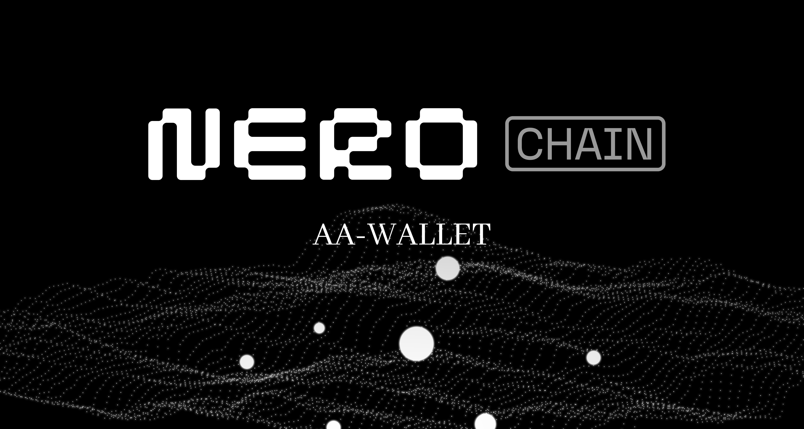

# NERO AA Wallet

A modern Account Abstraction (AA) wallet built with React, TypeScript, and cutting-edge Web3 technologies. This wallet implements ERC-4337 standards to provide gasless transactions, social authentication, and advanced account management features.



## 🚀 Features

### Core Account Abstraction Features
- **SimpleAccount Implementation**: Full ERC-4337 compliant account abstraction
- **Gasless Transactions**: Support for paymasters (token, verifying, legacy-token)
- **Deterministic Account Generation**: Predictable account addresses using EOA + salt + chain ID
- **Multi-Chain Support**: Cross-chain account management with network switching
- **Social Authentication**: Web3Auth integration for seamless user onboarding

### Account Management
- **Multi-Account Support**: Create and manage multiple AA accounts
- **Account Hiding/Showing**: Safely hide accounts without deletion
- **Account Recovery**: Deterministic recovery by index
- **Consolidation**: Automated fund consolidation across accounts
- **Real-time Balances**: Live balance tracking for native tokens and ERC-20s

### Security & Privacy
- **Deterministic Security**: Cryptographically secure account generation
- **Storage Isolation**: Separate storage contexts per authentication method
- **Secure Key Management**: No private key storage for AA accounts
- **Validation**: Input sanitization and account data validation

### User Experience
- **MetaMask-Style Interface**: Familiar wallet UI with modern design
- **Custom Modals**: Beautiful confirmation dialogs replacing browser alerts
- **Smooth Animations**: 150ms fade transitions for all dropdowns
- **Responsive Design**: Mobile-first responsive interface
- **Dark Theme**: Professional black gradient design system


## 🏗 Architecture

### Project Structure
```
src/
├── components/
│   ├── features/           # Feature-specific components
│   │   ├── AccountSelector/ # Account management UI
│   │   └── ...
│   ├── screens/            # Main application screens
│   ├── ui/                 # Reusable UI components
│   └── navigation/         # Navigation components
├── contexts/               # React contexts for global state
├── hooks/                  # Custom React hooks
├── types/                  # TypeScript type definitions
├── utils/                  # Utility functions and helpers
└── assets/                 # Static assets and images
```

## 🔧 Installation & Setup

### Prerequisites
- Node.js (v18 or higher)
- npm or yarn
- Git

### Installation
```bash
# Clone the repository
git clone https://github.com/nero-network/nero-aa-wallet.git
cd nero-aa-wallet

# Install dependencies
yarn install

# Start development server
yarn dev
```

### Environment Configuration
Create a `.env.local` file with required environment variables:
```env
VITE_WEB3AUTH_CLIENT_ID=your_web3auth_client_id (Required for social Login)
VITE_GOOGLE_CLIENT_ID=your_google_client_id (Required for social Login)
VITE_PAYMASTER_URL=your_paymaster_url
```

## 📱 Usage

### Getting Started
1. **Connect Wallet**: Use Web3Auth social login or connect existing wallet
2. **Create AA Account**: Generate your first Account Abstraction account
3. **Fund Account**: Transfer NERO or tokens to your AA address
4. **Start Transacting**: Enjoy gasless transactions with paymaster support

### Account Management
- **Switch Accounts**: Click account name in header to view account list
- **Create New Account**: Use "+" button in account dropdown
- **Hide Accounts**: Hide unused accounts (except first account - consolidation target)
- **Recover Accounts**: Use account recovery by index for deterministic restoration

### Fund Consolidation
- **Automatic Scanning**: System scans all accounts for balances
- **Preview Modal**: Review consolidation plan before execution
- **Progress Tracking**: Real-time transfer status monitoring
- **Safe Consolidation**: ERC-20 tokens transferred first, NERO reserved for gas

### Network Management
- **Network Switching**: Click network icon to switch between supported chains
- **Multi-Chain Accounts**: Same account address across different networks
- **Chain-Specific Balances**: Separate balance tracking per network

## 🔐 Account Abstraction Details

### Deterministic Account Generation
The wallet uses a sophisticated deterministic system:
```typescript
// Account generation formula
AA_Address = CREATE2(
  EOA_Address + Account_Index + Chain_ID + Salt
)

// First account always uses salt = 0 for compatibility
// Subsequent accounts use cryptographically secure deterministic salts
```

### Account Recovery Process
1. **Same EOA + Same Salt = Same AA Address**
2. **No private keys stored** for AA accounts
3. **Deterministic generation** ensures recoverability
4. **Index-based recovery** for manual restoration

### Paymaster Integration
- **Token Paymaster**: Pay gas fees with ERC-20 tokens
- **Verifying Paymaster**: Sponsored transactions with signature verification
- **Legacy Token Paymaster**: Backward compatibility support

## 🧪 Testing

The project includes comprehensive test coverage:
- **Security Tests**: 70+ tests for core security functions
- **Utility Tests**: Validation and helper function testing

Run tests:
```bash
npm run test
```

## 🔒 Security Features

### Data Protection
- **No Private Key Storage**: AA accounts don't store private keys
- **Encrypted Storage**: Sensitive data encrypted in localStorage
- **Input Validation**: Comprehensive sanitization and validation
- **Safe JSON Parsing**: Protected against parsing attacks

### Account Security
- **Deterministic Generation**: Cryptographically secure account creation
- **Salt Validation**: Input validation for deterministic salts
- **Address Verification**: Format and checksum validation
- **Storage Key Generation**: Authentication-specific storage isolation

### Transaction Security
- **Paymaster Verification**: Secure gas sponsorship
- **Transaction Simulation**: Pre-execution validation
- **Error Handling**: Comprehensive error management
- **Real-time Monitoring**: Transaction status tracking


## 🤝 Contributing

We welcome contributions! Please see our [Contributing Guidelines](CONTRIBUTING.md) for details.

### Development Workflow
1. Fork the repository
2. Create a feature branch
3. Make your changes
4. Add tests for new features
5. Ensure all tests pass
6. Submit a pull request

### Code Standards
- **TypeScript**: Full type coverage required
- **ESLint**: Follow project linting rules
- **Prettier**: Consistent code formatting
- **Testing**: Add tests for new functionality

## 📄 License

This project is licensed under the MIT License - see the [LICENSE](LICENSE) file for details.

## 📚 Documentation
For detailed information, please refer to the [official documentation](https://docs.nerochain.io/en).

## 📞 Support

For support and questions:
- **GitHub Issues**: [Open an issue](https://github.com/nerochain/nero-aa-wallet/issues)
- **Documentation**: [Wiki](https://github.com/nerochain/nero-aa-wallet/wiki)
